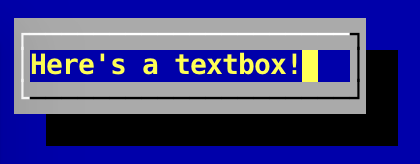

Text Boxes
---

Text boxes allow users to enter information. To create a text box:

```
	TextBox textBox = new TextBox();
```

You can pass in the (size)[examples/gui/component_sizing.md] of the textbox via the constructor:

```
	// Creates a textbox 30 columns long, 1 column high
	new TextBox(new TerminalSize(30,1));
```

If you want to create a multi-line textbox, simply increase the row size:

```
	// Creates a textbox 30 columns long, 5 column high
	new TextBox(new TerminalSize(30,5));
```

You can also add a border to the text box after instantiation:

```
	new TextBox(new TerminalSize(10, 1)).withBorder(Borders.singleLine("Heading"));
```

You can also supply some default text for the text box:

```
	new TextBox(new TerminalSize(10, 1), "Here is some default content!");
```

You can limit what the user can type into the text box by adding a validation pattern via `setValidationPattern`. The following example only allows the user to enter a single number into the text box:

```
	new TextBox().setValidationPattern(Pattern.compile("[0-9]"));
```

This will validate the users input on each key press and only allow a single number to be present in the textbox at any given time.

Partial matchings are not allowed; the whole pattern must match, however, empty lines will always be allowed. When the user tries to modify the content of the `TextBox` in a way that does not match the pattern, the operation will be silently ignored.

When setting the validation pattern on a given `TextBox`, the existing content will be validated. If the existing content does not match the provided pattern, a new `IllegalStateException` will be thrown.

### Screenshot


